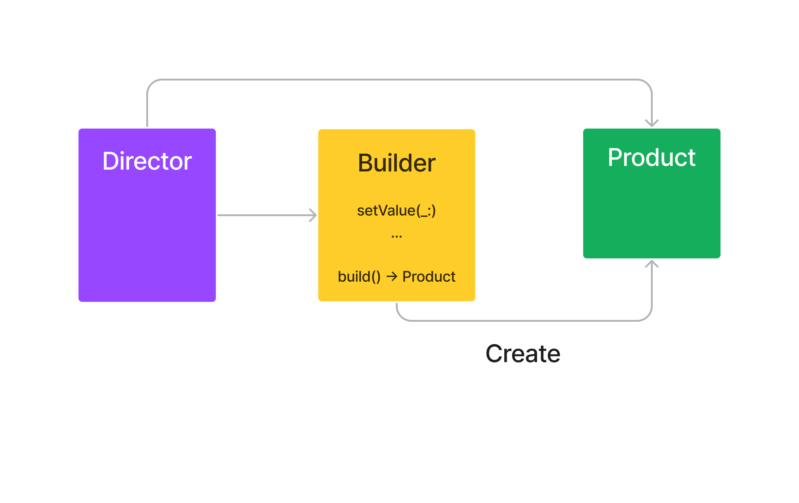

# Builder Pattern

어떤 객체를 생성자로 만들 때 한번에 모두 만들 수도 있지만,  
객체가 가지는 요소가 많을 때 여러 단계로 나누어 객체를 만들 수 있게 하는 패턴.

## Process

햄버거를 만든다고 할 때, 단계를 거쳐 만들고 싶을 때 사용할 수 있음.
<br>
<br>
  Director
  - 햄버거 만드는 방법을 알고 있는 사람.
  - 빵, 고기, 토핑, 채소 등을 순서에 상관없이 받음

 Builder
 - 이러한 재료를 가지고 햄버거를 만듦.

<br>  



### 재료  
<br> 

```swift
public enum Meat: String {
    case beef
    case chicken
    case pork
}

public enum Sauce: String {
    case mayonnaise
    case mustard
    case ketchup
    case secret
}

public enum Vegetable: String {
    case cabbage
    case lettuce
    case pickels
    case tomatoes
}

public enum Bread: String {
    case brownBread
    case hotDogBun
    case mealBread
    case ryeBread
}
```

<br>

### Hamburger


```swift

public struct Hamburger {
    public let meat: Meat
    public let sauce: Set<Sauce>
    public let vegetable: Set<Vegetable>
    public let bread: Bread
    
    func getAllProperty() {
        print("Meat = \(meat)")
        print("sauce = \(sauce)")
        print("vegetable = \(vegetable)")
        print("bread = \(bread)")
    }
}
```

<br>

## Builder

```swift
public class HamburgerBuilder {
    public private(set) var meat: Meat = .beef
    public private(set) var sauces: Set<Sauce> = []
    public private(set) var vegetables: Set<Vegetable> = []
    public private(set) var bread: Bread = .brownBread
    
    public func addSauce(_ sauce: Sauce) {
        sauces.insert(sauce)
    }
    
    public func removeSauce(_ sauce: Sauce) {
        sauces.remove(sauce)
    }
    
    
    public func addVegetable(_ vegetable: Vegetable) {
        vegetables.insert(vegetable)
    }
    
    public func removeVegetable(_ vegetable: Vegetable) {
        vegetables.remove(vegetable)
    }
    
    
    public func setMeat(_ meat: Meat) {
        self.meat = meat
    }
    
    public func setBread(_ bread: Bread) {
        self.bread = bread
    }
    
    public func build() -> Hamburger {
        return Hamburger(meat: meat, sauce: sauces, vegetable: vegetables, bread: bread)
    }
}
```

<br>

### How to use

```swift
let builder = HamburgerBuilder()
print("first burger")
var hamburger = builder.build()
hamburger.getAllProperty()

print("second burger")
builder.setMeat(.chicken)
builder.setBread(.hotDogBun)
builder.addSauce(.secret)
builder.addVegetable(.cabbage)
hamburger = builder.build()
hamburger.getAllProperty()
```
<br>

### Director

```swift
class HamburgerDirector {
    public func createBeefBurger() -> Hamburger {
        let builder = HamburgerBuilder()
        builder.setMeat(.beef)
        builder.addSauce(.ketchup)
        builder.addSauce(.mustard)
        builder.addVegetable(.lettuce)
        builder.setBread(.ryeBread)
        return builder.build()
    }
    
    public func createChickenBurger() -> Hamburger {
        let builder = HamburgerBuilder()
        builder.setMeat(.chicken)
        builder.addSauce(.secret)
        builder.addSauce(.mayonnaise)
        builder.addVegetable(.cabbage)
        builder.addVegetable(.tomatoes)
        builder.setBread(.brownBread)
        return builder.build()
    }
}
```
<br>


### Director Usage
```swift
let director = HamburgerDirector()
let beefBurger = director.createBeefBurger()
print("third burger")
beefBurger.getAllProperty()
```

