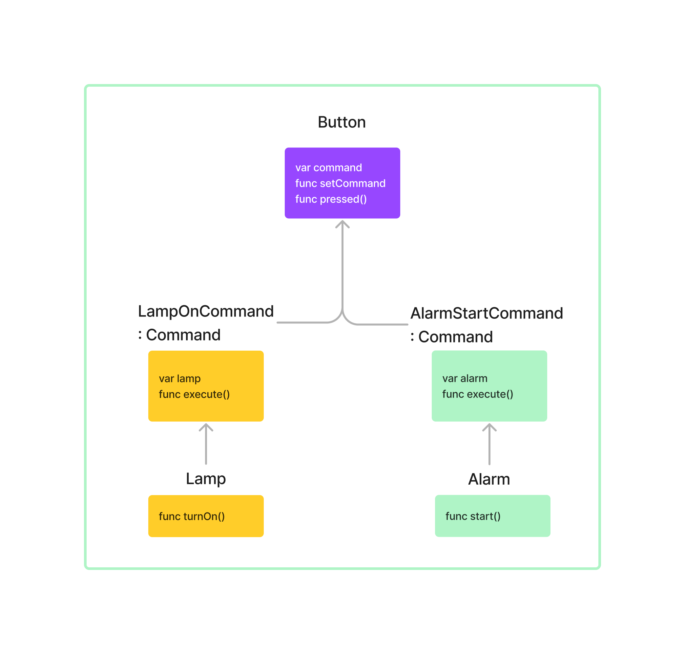

 # Command Pattern 
 ## 실행될 기능을 추상화, 캡슐화하여 한 클래스에서 여러 기능을 실행할 수 있도록 하는 패턴.

```swift
class Lamp {
    func turnOn() {
        print("Lamp On")
    }
}

class Button {
    private let lamp: Lamp
    
    init(lamp: Lamp) {
        self.lamp = lamp
    }
    
    func pressed() {
        self.lamp.turnOn()
    }
}

let lamp = Lamp()
let lampButton = Button(lamp: lamp)
lampButton.pressed() // Lamp On 
```
<br>

문제점: 추후 새로운 기능을 추가하거나, 한 버튼에서 여러 역할을 수행할 수 있도록 수정하려면 문제가 발생.<br>
1. 버튼이 다른 기능을 수행하려면?  
   
- Alarm Class 를 만들고, Button 의 생성자에서 Alarm 의 인스턴스를 인자로 받아 버튼 인스턴스를 생성해야함.
기존 버튼 클래스를 수정해야함.
<br>
<br>
2. 한 버튼에서 순차적으로 다른 기능을 수행하려면?  
- 필요한 기능이 추가될 때마다 버튼 클래스 코드를 수정해야함.

<br>

이때 Command Pattern 을 이용한다면?  
새로운 Class 를 추가하더라도, Command protocol 만 conform 하게 만들면 Button Class 를 수정하지 않고 얼마든지 추가할 수 있다.
<br>
<br>

```swift
protocol Command {
    func execute()
}

class Button {
    private var command: Command
    
    init(command: Command) {
        self.command = command
    }
    
    func setCommand(command: Command) {
        self.command = command
    }
    
    func pressed() {
        self.command.execute()
    }
}


class Lamp {
    func turnOn() {
        print("Lamp On")
    }
}

class LampOnCommand: Command {
    private var lamp: Lamp
    
    init(lamp: Lamp) {
        self.lamp = lamp
    }
    
    func execute() {
        self.lamp.turnOn()
    }
}


class Alarm {
    func start() {
        print("Alarm Start")
    }
}

class AlarmStartCommand: Command {
    private var alarm: Alarm
    
    init(alarm: Alarm) {
        self.alarm = alarm
    }
    
    func execute() {
        self.alarm.start()
    }
}


let lamp = Lamp()
let lampOnCommand = LampOnCommand(lamp: lamp)

let alarm = Alarm()
let alarmStartCommand = AlarmStartCommand(alarm: alarm)

let button1 = Button(command: lampOnCommand)
button1.pressed() // Lamp On

let button2 = Button(command: alarmStartCommand)
button2.pressed() // Alarm Start
button2.setCommand(command: lampOnCommand)
button2.pressed() // Lamp On
```
<br>
<br>




