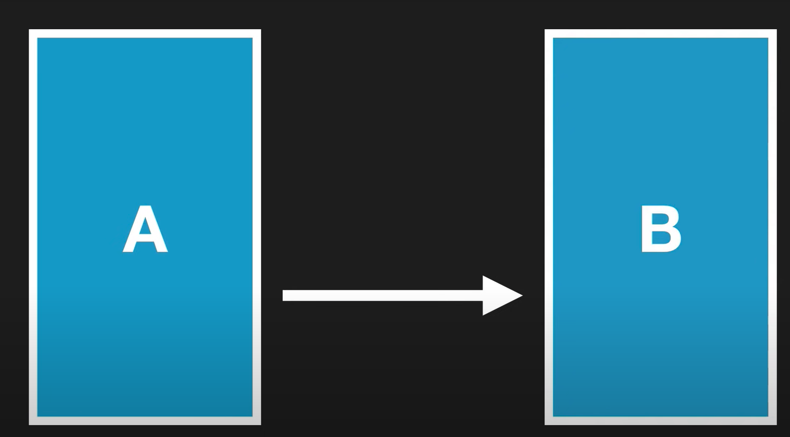
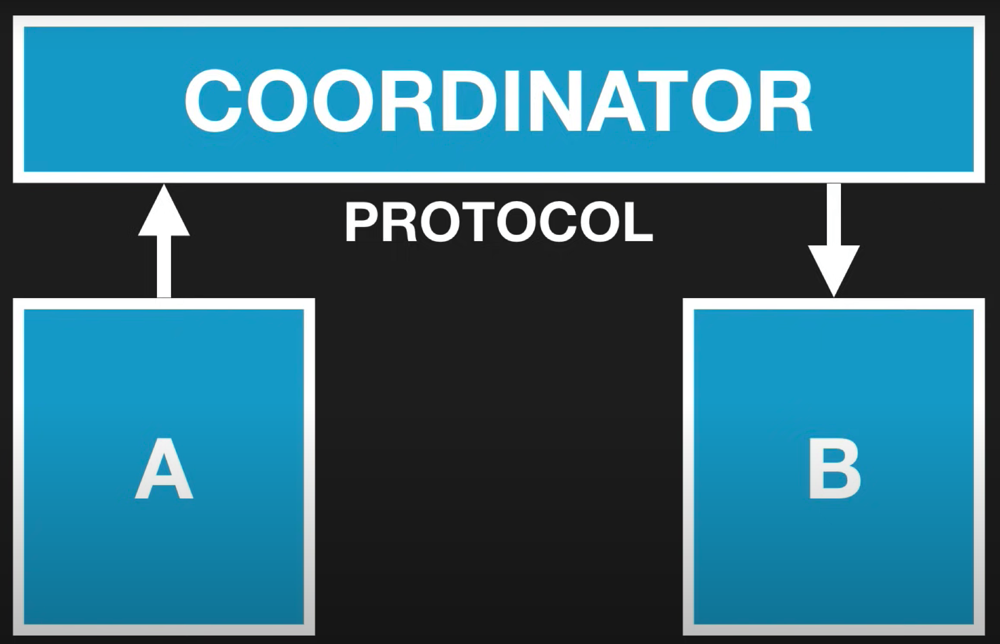
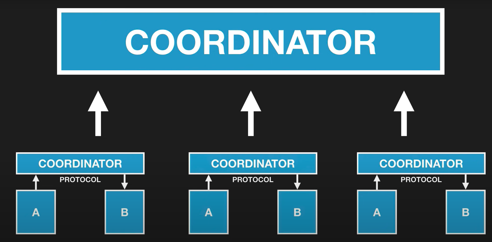
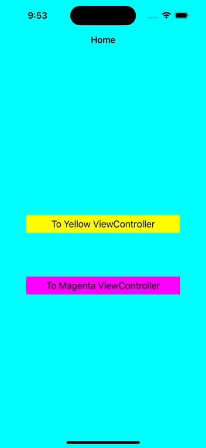

# Coordinator Pattern


## **Problem**

ViewController 간 tight 한 Coupling.<br>
APPLE 에서 만든 UIViewController 는 너무 많은 역할을 수행하도록 디자인되어있음.<br>
*View*, *Controller*, *API call* 등 -> MassiveVC 초래

그래서 역할의 분배가 필요함. <br>
Coordinator 에서 맡아줄 것은 **Navigation**!
<br>
<br>
## **Navigation**
App 내에서 화면(ViewController)간 flow 를 담당

<!-- Handle iPad/iPhone variants
 -->
<!-- Handle A/B Testing variants ( A/B Testing: 두 화면 Scenario 로 UX, Marketing 등의 테스트 ) -->
<br>

### Benefits <br>
flow 를 hard coding 하는 것 방지  
ViewControllers 의 **isolation** 도움  
<br>

### In Detail

**일반적인 경우**
2개의 ViewController A, B 가 있을 때
A -> B 로 이동 시 B에 대한 초기 정보를 A 에서 모두 제공해야하고, 이때 서로 강하게 묶이게 된다  <br>

<br><br><br>

**Coordinator pattern 을 사용하는 경우** 

A는 B에 대한 어떠한 정보도 모르는 상태. (어떠한 다른 ViewController 에 대해서도 모르는 상태) → **isolation**  
A 는 Coordinator 에게 정보를 전달, Coordinator 는 ViewController 간 push, pop 역할을 맡는다. 



<br><br><br>
앱이 커지면, 작은 Coordinator 를 더 큰 Coordinator 의 일부분으로 사용 가능.

<br><br><br>
## 코드 구현

1. Coordinator Protocol

```swift
protocol Coordinator {
    var navigationController: UINavigationController? {get set } // root controller for our app
    var children: [Coordinator]? { get set }
    var provider: Provider { get set }
    
    func eventOccurred(with type: Event)
    func start()
}
```

Provider

```swift
class Provider {
    public var color: UIColor?
    public var title: String?
}

```

2. Coordinator 에 사용되는 ViewController 가 conform 할 protocol 

```swift
protocol Coordinating {
    var coordinator: Coordinator? { get set }
}
```

3. 실제로 쓰일 Coordinator 

```swift
class MainCoordinator: Coordinator {
    var children: [Coordinator]? = nil
    
    var provider = Provider()
    
    var navigationController: UINavigationController? //rootVC
    
    func eventOccurred(with type: Event) {
        switch type {
            case .navToYellow:
                provider.color = .yellow
                provider.title = "Yellow ViewController"
                let vc = SecondViewController()
                
                vc.coordinator = self
                navigationController?.pushViewController(vc, animated: true)
                
            case .navToMagenta:
                provider.color = .magenta
                provider.title = "Magenta ViewController"
                let vc = SecondViewController()
                vc.coordinator = self
                navigationController?.pushViewController(vc, animated: true)
        }
    }
    
    func start() {
        let vc = FirstViewController()
        vc.coordinator = self
        navigationController?.setViewControllers([vc], animated: false)
    }
}

enum Event {
    case navToYellow
    case navToMagenta
}
```

4. ViewController 구현 예시

```swift
class FirstViewController: UIViewController, Coordinating {
    
    var coordinator: Coordinator?
    
    override func viewDidLoad() {
        super.viewDidLoad()
        
        view.backgroundColor = .cyan
        title = "Home"
        
        view.addSubview(gateToYellowViewController)
        view.addSubview(gateToMagentaViewController)
        
        // Button Layout Codes .. 

        gateToYellowViewController.addTarget(self, action: #selector(didTapBtn(_:)), for: .touchUpInside)
        gateToMagentaViewController.addTarget(self, action: #selector(didTapBtn(_:)), for: .touchUpInside)
    }
    
    @objc func didTapBtn(_ sender: UIButton) {
        if sender.tag == 2 {
            self.coordinator?.eventOccurred(with: .navToYellow)
        } else if sender.tag == 3 {
            self.coordinator?.eventOccurred(with: .navToMagenta)
        }
    }

    private let gateToYellowViewController: UIButton = {
        let button = UIButton()
        // button layout .. 
        button.tag = 2
        return button
    }()
    
    private let gateToMagentaViewController: UIButton = {
        let button = UIButton()
        // button layout .. 
        button.tag = 3
        return button
    }()
}
```

```swift
class SecondViewController: UIViewController, Coordinating {
    
    var coordinator: Coordinator?
    
    override func viewDidLoad() {
        super.viewDidLoad()
        view.backgroundColor = coordinator?.provider.color ?? .white
        title = coordinator?.provider.title ?? "Some Title"
    }
}
```

5. AppDelegate

```swift
class AppDelegate: UIResponder, UIApplicationDelegate {

	var window: UIWindow?

    func application(_ application: UIApplication, didFinishLaunchingWithOptions launchOptions: [UIApplication.LaunchOptionsKey: Any]?) -> Bool {
        // Override point for customization after application launch.
        
        let navVC = UINavigationController() // rootVC

        let coordinator = MainCoordinator()
        coordinator.navigationController = navVC
        
        let window = UIWindow(frame: UIScreen.main.bounds)
        window.rootViewController = navVC
        window.makeKeyAndVisible()
        self.window = window
        
        coordinator.start()
        
        return true
    }
}
```

6. SceneDelegate

```swift
import UIKit

class SceneDelegate: UIResponder, UIWindowSceneDelegate {

    var window: UIWindow?

    func scene(_ scene: UIScene, willConnectTo session: UISceneSession, options connectionOptions: UIScene.ConnectionOptions) {
       
        guard let windowScene = (scene as? UIWindowScene) else { return }
        let navVC = UINavigationController() // rootVC
        
        let coordinator = MainCoordinator()
        coordinator.navigationController = navVC
        
        let window = UIWindow(windowScene: windowScene)
        window.rootViewController = navVC
        window.makeKeyAndVisible()
        self.window = window
        
        coordinator.start()
    }
}
```

<br><br>


<br><br><br>

출처  
[https://www.youtube.com/watch?v=7HgbcTqxoN4](https://www.youtube.com/watch?v=7HgbcTqxoN4)<br>
[https://www.youtube.com/watch?v=SAZzcKvOvAE](https://www.youtube.com/watch?v=SAZzcKvOvAE)<br>
<br>
creator: Soroush Khanlou  ([https://khanlou.com/](https://khanlou.com/))

<!-- Coordinator 를 통한 정보전달 예시는 ?  -->