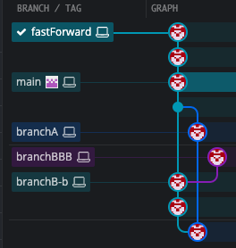
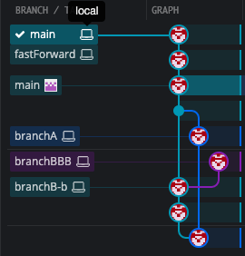
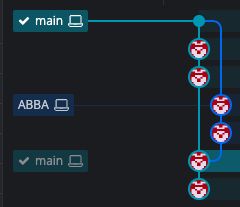

# HEAD
- HEAD 는 branch 를 가리키고, branch 는 commit 을 가리킨다.

현재 directory 에서 ```cat .git/HEAD```  -> HEAD 가 가리키는 곳(branch) 저장되어 있는 파일  contents 출력
<br>
<br>
또는
> 1. ```cd .git``` (현재 directory 에서 .git 으로 이동)  
> 2. ```cat HEAD``` (현재 HEAD 가 가리키는 branch 이름 출력.)
> 3.  ref: refs/heads/branchBBB

```.git/refs/heads``` 로 이동하면, 각 branch 가 가리키는 commit id 볼 수 있음.


<br>


# Branch

- ### branch 생성 시, 생성하는 위치(commit) 에서 추가됨.

- ### add, commit 을 하지 않더라도 새로운 Unstaged file 의 경우 branch 이동 시 따라갈 수 있음;; 

<br><br><br>

# Git Commands

```git commit -a -m```  
수정된 것들은 포함되지만, 새로 생성된 file/directory 는 추가되지 않음.  
새로 생성되었을 경우 **```git add```** 먼저 해주고 commit 하기!

<br>

## branch 생성
```git branch <branch_name>```

<br>
## branch 이동
```git checkout <branch_name>```

``` git switch <branch_name>``` (newer)

<br>

## branch 생성 후 이동

```git checkout -b <branch_name>```  
```git switch -c <branch_name>```  
(_*_ b: branch, c: create)  
<br>

## branch 제거
>**현재 위치해있는 branch는 제거할 수 없음.**
<br>

```git branch -d <branch_name>```<br>
지울 수 있으면 제거 (merge 되어있거나, 다른 branch 가 해당 branch 내에서 생성되었거나..)
<br>
<br>
```git branch -D <branch_name>```  
  D: shortcut for  '```--delete --force```'
<br>
<br>

## branch 이름 변경
<br>

```git branch -m <new_branch_name>```  
현재 위치해있는 branch 이름 변경  
<br>
```git branch -m <old_branch_name> <new_branch_name>```  
다른 branch 이름 변경
> m: Move/rename

<br>
<hr>
<br>

# Merging

#### We merge <ins>branches</ins>, not specific commits  
#### We always merge to the <ins>current HEAD</ins> branch

<br>

### To merge the bugfix branch into master  

1. ```git switch master```  
2. ```git merge bugfix```  

## Fast Forward Merge
**Catch up**  
새로 branch 생성 및 새로운 branch 에서 여러 commit 후 이전 branch 에서 빠르게 따라잡는 형태   
기존 branch 에서 새로운 commit 이 없는 경우.

<br>

### before


<br>
```
git switch main
git merge fastForward
```

>Updating 652e6ab..3cc106d  
>Fast-forward  
>fast.txt | 2 ++  
>1 file changed, 2 insertions(+)

<br>

### after
<br>



## ort Strategy



>merge-ort is a relatively new Git merge strategy that is significantly faster (for example, complex merge commits that previously took 5 or more seconds to create are now created in less than 200 milliseconds) and addresses subtle correctness issues found in the merge-recursive strategy. And because merge-ort is the **default merge strategy in the latest releases of Git**, merge results are now more predictable and consistent between your local machine and GitHub. -  2022.9.12


## Merge Conflicts
```
<<<<<<< HEAD
I have 2 cats
I also have chickens
=============
I used to have a dog:(
>>>>>>> bug-fix
```
====== 위: Merge 를 시도한 현재 위치(branch)

====== 아래: Merge 하려고 하는 대상. (I used to have a dog)

### Resolving Conflicts
Whenever you encounter merge conflicts, follow these steps to resolve them:
1. Open up the file(s) with merge conflicts
2. Edit the file(s) to remove the conflicts. Decide which branch's content you want to keep in each conflict. Or keep the content from both.
3. Remove the conflict "markers" in the document
4. **Add your changes and then make a commit!**


<br><br><br>
출처  
https://github.blog/changelog/2022-09-12-merge-commits-now-created-using-the-merge-ort-strategy/

<br>
* useful free tool: GitKraken