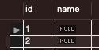

# Auto Increment

```SQL
CREATE TABLE unique_cats
(
	cat_id INT AUTO_INCREMENT,
	name VARCHAR(100),
	age INT,
	PRIMARY KEY (cat_id)
)
```

or

```SQL
CREATE TABLE unique_cats
(
	cat_id INT AUTO_INCREMENT PRIMARY KEY, -- 순서 바뀌어도 무관
	name VARCHAR(100),
	age INT
)
```
<br>

```SQL
INSERT INTO autoCats() VALUES();
INSERT INTO autoCats() VALUES();
```

