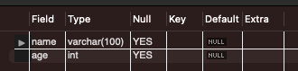
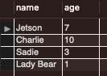

# SQL

- DataBase 는 기본적으로 bunch of tables 라고 생각하면 된다. (최소 관계형 DB 에서는)
- 하나의 DataBase Server 에 여러 Database 가 있을 수 있다. (서로 관련 없을 수 있음)
  
<br>

### 기본 SQL 명령어
```SHOW DATABASES``` : 데이터베이스 목록 조회  
```CREATE DATABASE <db_name>``` : 데이터베이스 생성  
```DROP DATABASE <db_name>``` : 데이터베이스 제거  
``` USE <db_name>``` : 데이터베이스 사용 선언  
```SELECT database()``` : 현재 사용중인 db 조회

<br>

## Tables

SQL 의 핵심
Databases 는 tables 로 이루어짐.  
Table 은 Data 를 가짐  
"A collection of related data held in a structured format within a database"

<br>

### 예시

- headers: Columns
- Rows: 실제 데이터 

|Name|Breed|Age|
|--|--|--|
|Blue|Scottish Fold|1|
|Rocket|Persian|3|
|Monty|Tabby|10|
|Sam|Munchkin|5|

## Data Types
- Int, ...
- VARCHAR(max), ... 

Int: A Whole Number (no decimals)  
VARCHAR: A Variable-Length String

<Br>

## table 생성

### Syntax

```SQL
CREATE TABLE tablename
	(
		column_name1 data_type1,
		column_name2 data_type2
	)
```

```SQL
CREATE TABLE cats
(
	name VARCHAR(100)
	age Int
)
```

|name|age|
|--|--|
|Blue|1|

<br>

### Commands

```SHOW TABLES``` : Table 목록 조회  
```DESC <table_name>``` : Column 목록 조회 (```DESCRIBE <table_name>```)  
```SHOW COLUMNS FROM <table_name>``` : 위와 동일  
```DROP TABLE <table_name>``` : TABLE 제거  
<br>


<br>

```SQL
CREATE TABLE photo_tags 
	(
		photo_id INTEGER NOT NULL,
    	tag_id INTEGER NOT NULL,
    	FOREIGN KEY(photo_id) REFERENCES photos(id),
    	FOREIGN KEY(tag_id) REFERENCES tags(id),
    	PRIMARY KEY(photo_id, tag_id)
    );
```

## DATA 저장하기
```SQL
INSERT INTO <table_name>(col_name1, col_name2)
VALUES
(value_a1, value_a2),
(value_b1, value_b2),
...
```


```SQL
INSERT INTO cats(name, age)
VALUES('Jetson', 7);
```


```SQL
INSERT INTO cats(name, age)
VALUES 
('Charlie', 10),
('Sadie', 3),
('Lazy Bear', 1);
```


```SELECT * FROM <table_name>``` : Fetch DATA FROM <table_name>  
<br>
<!--  -->



