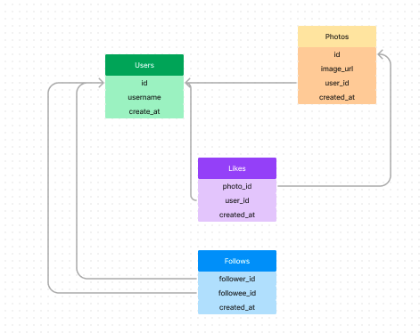

# Instagram Clone

```SQL
CREATE DATABASE instagram;

USE instagram;
```


<br>
<br>


```SQL
CREATE TABLE users
(
id INT PRIMARY KEY AUTO_INCREMENT,
username VARCHAR(50) UNIQUE NOT NULL,
created_at TIMESTAMP DEFAULT NOW()
);
```


```SQL
CREATE TABLE photos
(
id INT AUTO_INCREMENT PRIMARY KEY,
image_url VARCHAR(255) UNIQUE NOT NULL,
user_id INT NOT NULL,
created_at TIMESTAMP DEFAULT NOW(),
FOREIGN KEY (user_id) REFERENCES users(id)
);
```


```SQL
CREATE TABLE comments
(
id INT AUTO_INCREMENT PRIMARY KEY,
comment_text VARCHAR(255) NOT NULL,
user_id INT NOT NULL,
photo_id INT NOT NULL,
created_at TIMESTAMP DEFAULT NOW(),
FOREIGN KEY (user_id) REFERENCES users(id),
FOREIGN KEY (photo_id) REFERENCES photos(id)
);
```

<br>
<br>
<br>




```SQL
CREATE TABLE likes
(
photo_id INT NOT NULL,
user_id INT NOT NULL,
created_at TIMESTAMP DEFAULT NOW(),
FOREIGN KEY (photo_id) REFERENCES photos(id),
FOREIGN KEY (user_id) REFERENCES users(id),
PRIMARY KEY(user_id, photo_id)
);
```
```SQL
CREATE TABLE follows( 
follower_id INT NOT NULL,
followee_id INT NOT NULL,
created_at TIMESTAMP DEFAULT NOW(),
FOREIGN KEY (follower_id) REFERENCES users(id),
FOREIGN KEY (followee_id) REFERENCES users(id),
PRIMARY KEY (follower_id, followee_id)
);
```


```SQL
CREATE TABLE tags
(
id INT AUTO_INCREMENT PRIMARY KEY,
tag_name VARCHAR(255) UNIQUE,
created_at TIMESTAMP DEFAULT NOW()
);
```
```SQL
CREATE TABLE photo_tags
(
photo_id INT NOT NULL,
tag_id INT NOT NULL,
FOREIGN KEY (photo_id) REFERENCES photos(id),
FOREIGN KEY (tag_id) REFERENCES tags(id),
PRIMARY KEY (photo_id, tag_id)
);
```