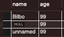

## Null: No Value

```SQL
CREATE TABLE cats
(
	name VARCHAR(100) NOT NULL,
	age INT NOT NULL
)
```


```SQL
INSERT INTO cats(name) 
VALUES('Bilbo')
``` 
<br>

 Error! Field 'age' doesn't have a default value
<br>
<br>


## Default Value

```SQL
CREATE TABLE cats
(
	name VARCHAR(100) DEFAULT 'unnamed',
	age INT DEFAULT 99
)
```
이렇게 설정해도 Null 값 넣을 수 있음.
```SQL
INSERT INTO cats(name)
VALUES ('Bilbo')
```
```SQL
INSERT INTO cats()
VALUES ()
```



따라서, DEFAULT VALUE 설정하는 것과 NOT NULL 로 설정하는 경우가 동시에 발생할 수 있음.
```SQL
CREATE TABLE cats
(
	name VARCHAR(100) NOT NULL DEFAULT 'unnamed',
	age INT NOT NULL DEFAULT 99
)
```
