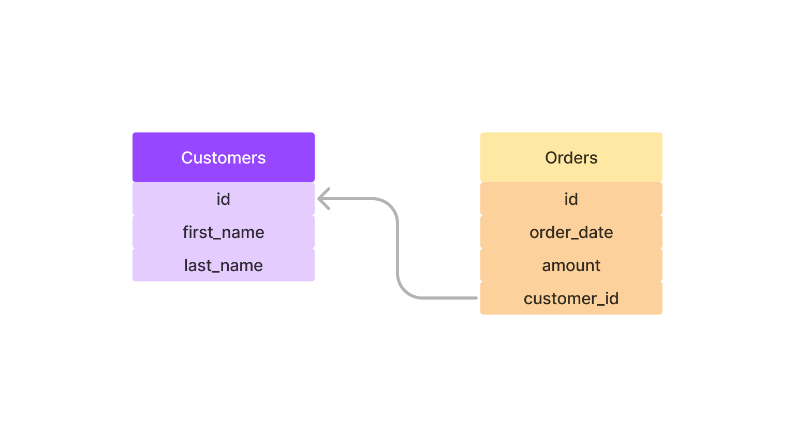

# One to Many Relationships

## customers & orders

**Customers** can have multiple **orders**,   
but **those orders** only belong to **one** customer.



```SQL
CREATE TABLE customers
(
id INT PRIMARY KEY AUTO_INCREMENT,  
first_name VARCHAR(20),  
last_name VARCHAR(20)
);  
```

```SQL
CREATE TABLE orders
(
id INT PRIMARY KEY AUTO_INCREMENT,
order_date DATE,
amount DECIMAL(8,2),
customer_id INT,
FOREIGN KEY (customer_id) REFERENCES customers(id) ON DELETE CASCADE 
-- customer 가 사라지는 경우, 해당 customer 의 id 를 foreign key 로 가지는 order row 함께 제거. 
)
```

<br>

### Customer

|id|first_name|last_name|  
|---|---|---|
|1|Boy|George|  
|2|George|Michael|
|3|David|Bowie|
|4|Blue|Steele|

<br>

### Orders

|id|order_date|amount|customer_id|
|---|---|---|---|
|1|'2023/02/10'|99.99|1|
|2|'2023/11/11'|35.50|1|
|3|'2023/10/09'|800.67|2|
|4|'2023/07/22'|12.50|2|

<br><br>


## Practice

```SQL
INSERT INTO customers (first_name, last_name, email) 
VALUES ('Boy', 'George', 'george@gmail.com'),
       ('George', 'Michael', 'gm@gmail.com'),
       ('David', 'Bowie', 'david@gmail.com'),
       ('Blue', 'Steele', 'blue@gmail.com'),
       ('Bette', 'Davis', 'bette@aol.com');
```
```SQL
INSERT INTO orders (order_date, amount, customer_id)
VALUES ('2016-02-10', 99.99, 1),
       ('2017-11-11', 35.50, 1),
       ('2014-12-12', 800.67, 2),
       ('2015-01-03', 12.50, 2),
       ('1999-04-11', 450.25, 5);
```

```SQL
-- print all orders
SELECT * FROM orders;
```

```SQL
INSERT INTO orders(order_date, amount, customer_id)
VALUES('1999-04-11', 450.25, 10); 
-- invalid foreign key error!
-- cannot add or update a child row; a foreign key constraint fails 
-- (FOREIGN KEY ('customer_id') REFERENCES 'customers' ('id'))
```

```SQL
-- SELECT 'Boy George's orders
SELECT id FROM customers WHERE first_name='Boy' and last_name='George';
SELECT * FROM orders WHERE customer_id=1;

-- using one line 
SELECT * FROM orders WHERE customer_id = (SELECT id FROM customers WHERE last_name='George');
```

```SQL
SELECT * FROM customers, orders; 
-- CrossJoin: Combination of customers X orders (meaningless data)
```

```SQL
-- select all customers, orders data only if matched customer_id exist
SELECT * FROM customers 
JOIN orders
ON customers.id = orders.customer_id;
```

```SQL
-- print specific infos from matched data
SELECT customers.id, first_name, last_name, order_date, amount FROM customers
JOIN orders
ON customers.id = orders.customer_id;
```

```SQL
-- print name and sum of amount of customers with orders
SELECT first_name, last_name, SUM(amount) as total FROM customers
JOIN orders
ON customers.id = orders.customer_id
GROUP BY first_name, last_name
ORDER BY total;
```

```SQL
-- select all data (of customers) even if there's no matched data from orders
SELECT first_name, last_name, order_date, amount FROM customers
LEFT JOIN orders ON orders.customer_id = customers.id;
```

```SQL
-- select sum of customer's order data. 
SELECT first_name, last_name, IFNULL(SUM(amount), 0) AS money_spent FROM customers 
LEFT JOIN orders ON orders.customer_id = customers.id 
GROUP BY first_name, last_name;
```