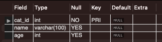

# Primary Key

- A Unique Identifier for each record in the table
- A ***table*** can have only ONE primary key
- In the table, the primary key can consist of singlel or multuple columns
- Each table should have a Primary key
  

```SQL
CREATE TABLE unique_cats
(
	cat_id INT PRIMARY KEY,
	name VARCHAR(100),
	age INT
)
```

or
<br>

```SQL
CREATE TABLE unique_cats
(
	cat_id INT
	name VARCHAR(100) NOT NULL,
	age INT NOT NULL
	PRIMARY KEY (cat_id)
)
```



```SQL
INSERT INTO unique_cats(cat_id) VALUES(1);
INSERT INTO unique_cats(cat_id) VALUES(1);
```
``` Error: Duplicate entry '1' for key 'unique_cats.PRIMARY'```