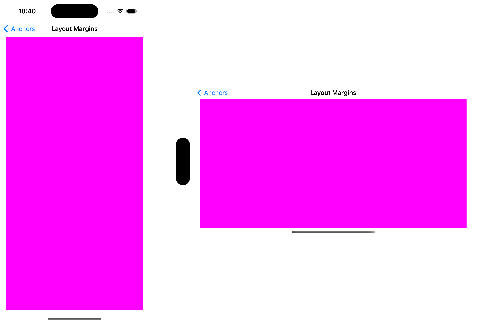

# LayoutMarginsGuide


## Summary
> A layout guide representing the view’s margins.

<br>


## Declaration
```swift
var layoutMarginsGuide: UILayoutGuide { get }
```

## Discussion
>Use this layout guide’s anchors to create constraints with the view’s margin.

<br>

iPhone 14 Pro 기준 양옆: 16 <br>
iPhone 14 Pro Max 양옆: 20 

<br>

```swift
func setupViews() {
        navigationItem.title = "Layout Margins"

        let redView = UIView()
        redView.translatesAutoresizingMaskIntoConstraints = false
        redView.backgroundColor = .red

        view.addSubview(redView)

        NSLayoutConstraint.activate([
            redView.topAnchor.constraint(equalTo: view.layoutMarginsGuide.topAnchor),
            redView.leadingAnchor.constraint(equalTo: view.layoutMarginsGuide.leadingAnchor),
            redView.trailingAnchor.constraint(equalTo: view.layoutMarginsGuide.trailingAnchor),
            redView.bottomAnchor.constraint(equalTo: view.layoutMarginsGuide.bottomAnchor)
        ])
    }
```

<br>



