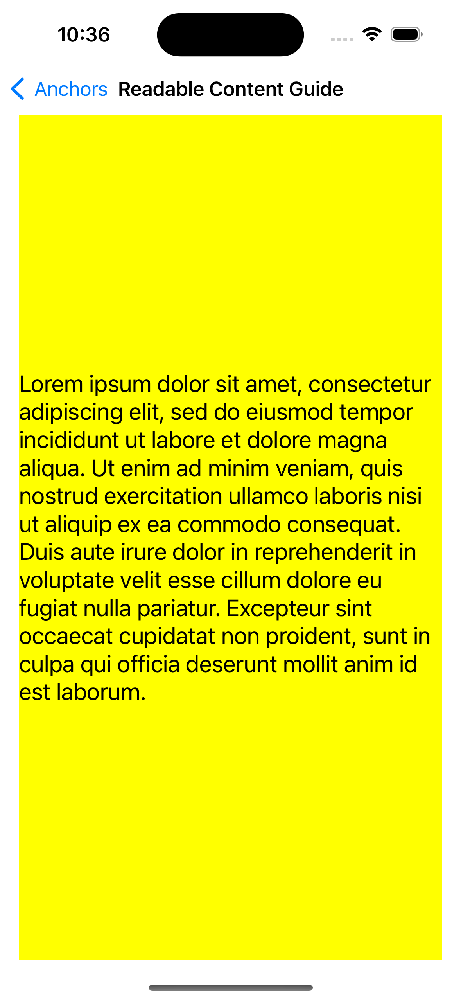
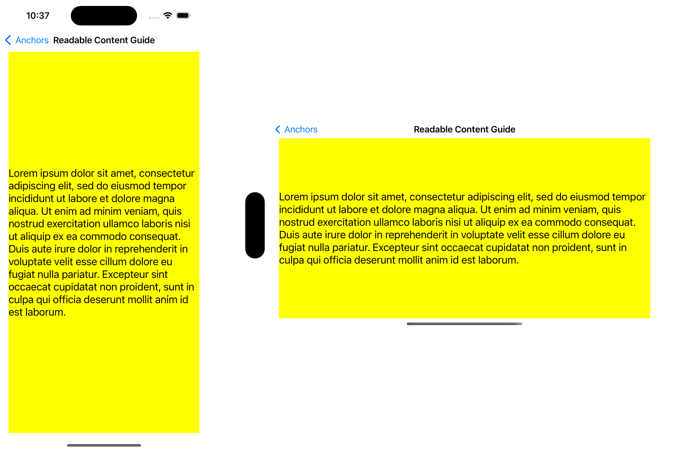
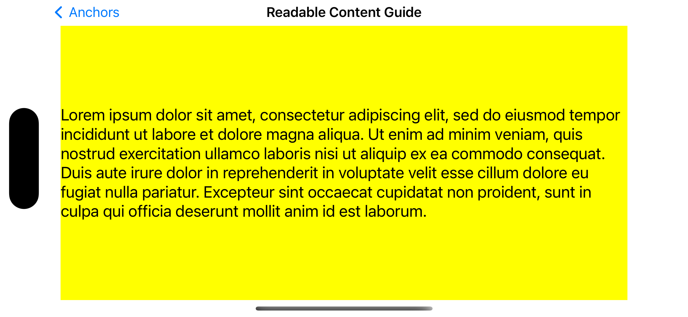

# ReadableContentGuide

## Summary
>A layout guide representing an area with a readable width within the view.

## Declaration

```swift
var readableContentGuide: UILayoutGuide { get }
```

## Discussion

>This layout guide defines an area that **can easily be read without forcing users to move their head to track the lines.** The readable content area follows the following rules:
The readable content guide **never extends beyond the view’s layout margin guide**.
The readable content guide is **vertically centered inside the layout margin guide**.
The readable content guide’s width is equal to or less than the readable width defined for the current dynamic text size.
Use the readable content guide to lay out a single column of text. If you are laying out multiple columns, you can use the guide’s width to determine the optimal width for your columns.

<br>

<!--  -->

<!--  -->
