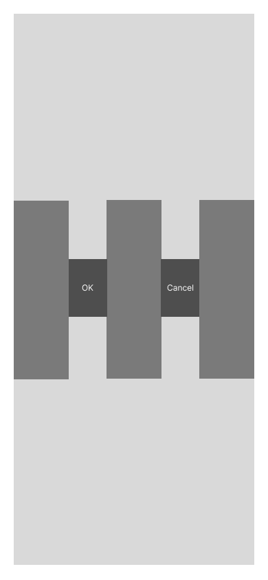

# UILayoutGuide

## Summary

>A rectangular area that can interact with Auto Layout.
<br>
## Declaration
>@MainActor class UILayoutGuide : NSObject

## Discussion

Use layout guides to **replace the placeholder views you may have created to represent inter-view spaces or encapsulation in your user interface**. Traditionally, there were a number of Auto Layout techniques that required placeholder views. A placeholder view is an empty view that does not have any visual elements of its own and serves only to define a rectangular region in the view hierarchy. For example, if you wanted to use constraints to define the size or location of an empty space between views, you needed to use a placeholder view to represent that space. If you wanted to center a group of objects, you needed a placeholder view to contain those objects. Similarly, placeholder views could be used to contain and encapsulate part of your user interface. 

Placeholder views let you break up a large, complex user interface into self-contained, modular chunks. When used properly, they could greatly simplify your Auto Layout constraint logic.
There are a number of costs associated with adding placeholder views to your view hierarchy. First, there is the cost of creating and maintaining the view itself. Second, the placeholder view is a full member of the view hierarchy, which means that it adds overhead to every task the hierarchy performs. Worst of all, the invisible placeholder view can intercept messages that are intended for other views, causing problems that are very difficult to find.
The UILayoutGuide class is designed to perform all the tasks previously performed by placeholder views, but to do it in a safer, more efficient manner. Layout guides do not define a new view. They do not participate in the view hierarchy. Instead, they simply define a rectangular region in their owning view’s coordinate system that can interact with Auto Layout.

정리: placeHolderView 대신 사용하는 view.
* placeHolderView: spacer 역할, 또는 다른 view 들을 안에 위치시키기 위해 만든 **비어있는** view. 
* 이것을 사용함으로써 view 자체를 생성하지 않아도 되고, view hierarchy 를 처리하는 데 드는 비용 감소 가능. 
* placeholderView 가 다른 views 에 전해지는 message 를 intercept 하는 것 방지
* 훨씬 안전하고, 효율적인 방식으로 placeholder views 가 하던 것들 대체.
* view hierarchy 에 관여되지 않음. 대신, Auto Layout 과 interact 할 수 있는 단순한 사각형 영역이라고 생각하면 됨.
  

*overhead: 어떤 처리를 하기 위해 들어가는 간접적인 처리시간, 메모리 등.


```swift
func setupViews() {
        navigationItem.title = "Spacer Views"

        // create controls
        let leadingGuide = UILayoutGuide()
        let okButton = makeButton(withText: "OK", color: UIColor.darkBlue)
        let middleGuide = UILayoutGuide()
        let cancelButton = makeButton(withText: "Cancel", color: UIColor.darkGreen)
        let trailingGuide = UILayoutGuide()

        // add to subView and layoutGuide
        view.addSubview(okButton)
        view.addSubview(cancelButton)
        view.addLayoutGuide(leadingGuide)
        view.addLayoutGuide(middleGuide)
        view.addLayoutGuide(trailingGuide)

        // setup constraints
        let margins = view.layoutMarginsGuide

        // leading guide
        margins.leadingAnchor.constraint(equalTo: leadingGuide.leadingAnchor).isActive = true
        leadingGuide.trailingAnchor.constraint(equalTo: okButton.leadingAnchor).isActive = true

        // middle guide
        okButton.trailingAnchor.constraint(equalTo: middleGuide.leadingAnchor).isActive = true
        middleGuide.trailingAnchor.constraint(equalTo: cancelButton.leadingAnchor).isActive = true

        // trailing guide
        cancelButton.trailingAnchor.constraint(equalTo: trailingGuide.leadingAnchor).isActive = true
        trailingGuide.trailingAnchor.constraint(equalTo: margins.trailingAnchor).isActive = true

        // equal widths
        okButton.widthAnchor.constraint(equalTo: cancelButton.widthAnchor).isActive = true
        leadingGuide.widthAnchor.constraint(equalTo: middleGuide.widthAnchor).isActive = true
        leadingGuide.widthAnchor.constraint(equalTo: trailingGuide.widthAnchor).isActive = true

        // vertical position
        leadingGuide.centerYAnchor.constraint(equalTo: view.centerYAnchor).isActive = true
        middleGuide.centerYAnchor.constraint(equalTo: view.centerYAnchor).isActive = true
        trailingGuide.centerYAnchor.constraint(equalTo: view.centerYAnchor).isActive = true
        okButton.centerYAnchor.constraint(equalTo: view.centerYAnchor).isActive = true
        cancelButton.centerYAnchor.constraint(equalTo: view.centerYAnchor).isActive = true
    }
```


