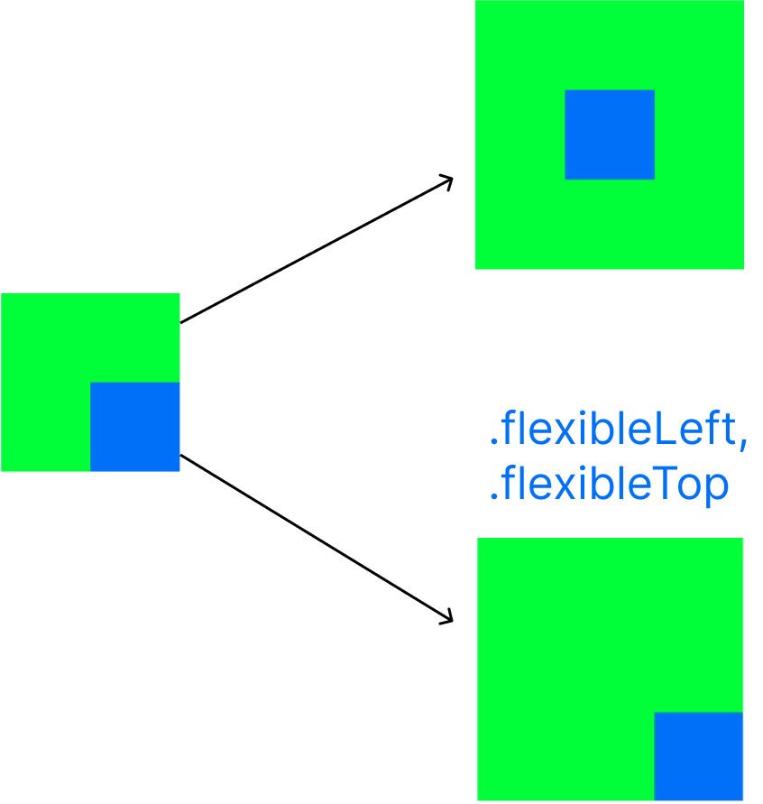

# UIView, Border on Specific Sides

```swift
import UIKit

extension UIView {
    enum ViewSide {
        case top
        case left
        case bottom
        case right
    }

    func addBorders(to sides: [ViewSide], in color: UIColor, width: CGFloat) {
        sides.forEach { addBorder(to: $0, in: color, width: width) }
    }

    func addBorder(to side: ViewSide, in color: UIColor, width: CGFloat) {
        switch side {
        case .top:
            addTopBorder(in: color, width: width)
        case .left:
            addLeftBorder(in: color, width: width)
        case .bottom:
            addBottomBorder(in: color, width: width)
        case .right:
            addRightBorder(in: color, width: width)
        }
    }

    func addTopBorder(in color: UIColor?, width borderWidth: CGFloat) {
        let border = UIView()
        border.backgroundColor = color
        border.frame = CGRect(x: 0, y: 0, width: frame.size.width, height: borderWidth)
        border.autoresizingMask = [.flexibleWidth, .flexibleBottomMargin]
        addSubview(border)
    }

    func addBottomBorder(in color: UIColor?, width borderWidth: CGFloat) {
        let border = UIView()
        border.backgroundColor = color
        border.frame = CGRect(x: 0, y: frame.size.height - borderWidth, width: frame.size.width, height: borderWidth)
        border.autoresizingMask = [.flexibleWidth, .flexibleTopMargin]
        addSubview(border)
    }

    func addLeftBorder(in color: UIColor?, width borderWidth: CGFloat) {
        let border = UIView()
        border.backgroundColor = color
        border.frame = CGRect(x: 0, y: 0, width: borderWidth, height: frame.size.height)
        border.autoresizingMask = [.flexibleHeight, .flexibleRightMargin]
        addSubview(border)
    }

    func addRightBorder(in color: UIColor?, width borderWidth: CGFloat) {
        let border = UIView()
        border.backgroundColor = color
        border.frame = CGRect(x: frame.size.width - borderWidth, y: 0, width: borderWidth, height: frame.size.height)
        border.autoresizingMask = [.flexibleHeight, .flexibleLeftMargin]
        addSubview(border)
    }
}
```
<hr><br>
사용 예

```swift
// let borderColor: UIColor = .magenta

private let deleteButton = UIButton().then {
        $0.setTitle("Delete", for: .normal)
        $0.setTitleColor(.red, for: .normal)
        $0.backgroundColor = .white
        $0.addBorders(to: [.top, .bottom], in: borderColor, width: 1)
    }
```

<br>
<br>
<hr>

## What is AutoResizingMask? 
SuperView 의 Size 가 변할 때, subViews 는 resize 된다.   
*이때, subView의 각 Side에 옵션(fixed or flexible)을 주어 Layout 의 생김새를 정하는 것.*<br>
<br>
해당 property 는 bit mask 로 구성되었고, 여기서 'mask'는 Bit 를 덮는다는 의미. <br>
각 <ins>Side</ins> 및 <ins>Width</ins>, <ins>Height</ins> 를 Flexible 로 처리할지에 대한 상태 값이 0(false), 1(true) 로 구성.  
1 로 digit 을 설정하면 주어진 bit mask 의 각 digit 을 <ins>'덮는다'</ins>는 것으로 추정. 


<br>
<br>

## AutoResizingMask 
<br>

```swift
public struct AutoresizingMask : OptionSet, @unchecked Sendable {

        public init(rawValue: UInt)
        // Resizing performed by expanding or shrinking a view’s width.
        public static var flexibleWidth: UIView.AutoresizingMask { get }
        public static var flexibleHeight: UIView.AutoresizingMask { get }

        // Resizing performed by expanding or shrinking a view in the direction of the left margin.
        public static var flexibleLeftMargin: UIView.AutoresizingMask { get }
        public static var flexibleRightMargin: UIView.AutoresizingMask { get }
        public static var flexibleTopMargin: UIView.AutoresizingMask { get }
        public static var flexibleBottomMargin: UIView.AutoresizingMask { get }
    }
}
```





***Summary***

An **<ins>integer bit mask</ins>* that ***determines how the receiver(subview) resizes itself when its superview’s bounds change.***

***Declaration***

```swift
var autoresizingMask: UIView.AutoresizingMask { get set }
```

***Discussion***

>**When a view’s bounds change, that view automatically resizes its subviews according to each subview’s autoresizing mask.** You specify the value of this mask by combining the constants described in UIView.AutoresizingMask using the C bitwise OR operator. Combining these constants lets you specify which dimensions of the view should grow or shrink relative to the superview. The default value of this property is none, which indicates that the view should not be resized at all.
>When more than one option along the same axis is set, the default behavior is to distribute the size difference proportionally among the flexible portions. The larger the flexible portion, relative to the other flexible portions, the more it is likely to grow. For example, suppose this property includes the flexibleWidth and flexibleRightMargin constants but does not include the flexibleLeftMargin constant, thus indicating that the width of the view’s left margin is fixed but that the view’s width and right margin may change. Thus, the view appears anchored to the left side of its superview while both the view width and the gap to the right of the view increase.
If the autoresizing behaviors do not offer the precise layout that you need for your views, you can use a custom container view and override its layoutSubviews() method to position your subviews more precisely.

<br>

  *<ins>integer bit mask</ins>: 정수의 이진수 표현을 활용한 기법, (OptionSet)

<br>


<br>

## 부가설명
<br>

autoresizing mask == **springs**, **struts** 
<hr>

**Springs** (늘어날 수 있는 방향)
- vertical spring (.flexibleHeight)
- horizontal spring (.flexibleWidth)
<hr>

**Struts** (제한을 주는 방향)  *(버팀대, 저항을 주어 늘어나지 못하게 하는 것.)*<br>

strut 가 존재하지 않다는 것은 해당 mask 에 대한 margin 이 flexible 하다는 것.
- .flexibleLeftMargin
- .flexibleRightMargin
- .flexibleTopMargin
- .flexibleBottomMargin

<br>
<hr>
<br>


# translateAutoresizingMaskIntoConstraints

## Summary

>A Boolean value that determines whether the view’s autoresizing mask is translated into Auto Layout constraints.

## Declaration

```swift
var translatesAutoresizingMaskIntoConstraints: Bool { get set }
```

## Discussion

>If this property’s value is true, the system creates a set of constraints that duplicate the behavior specified by the view’s autoresizing mask. This also lets you modify the view’s size and location using the view’s frame, bounds, or center properties, allowing you to create a **static, frame-based layout within Auto Layout**.
Note that the autoresizing mask constraints fully specify the view’s size and position; therefore, you cannot add additional constraints to modify this size or position without introducing conflicts. <ins>***If you want to use Auto Layout to dynamically calculate the size and position of your view, you must set this property to false, and then provide a non ambiguous, nonconflicting set of constraints for the view.***</ins>
By default, the property is set to true for any view you programmatically create. If you add views in Interface Builder(storyboard), the system automatically sets this property to false.
<br>
<br>


참고 자료<br>
[https://stackoverflow.com/questions/17355280/how-to-add-a-border-just-on-the-top-side-of-a-uiview](https://stackoverflow.com/questions/17355280/how-to-add-a-border-just-on-the-top-side-of-a-uiview)  
https://stackoverflow.com/questions/10468389/how-to-use-uiview-autoresizingmask-property-programmatically<br>
https://junyng.tistory.com/35

