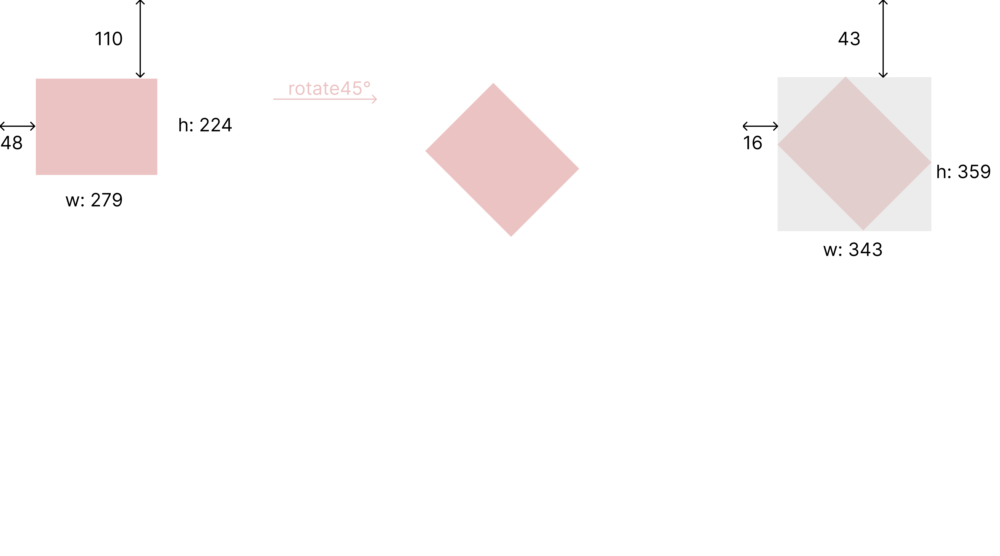
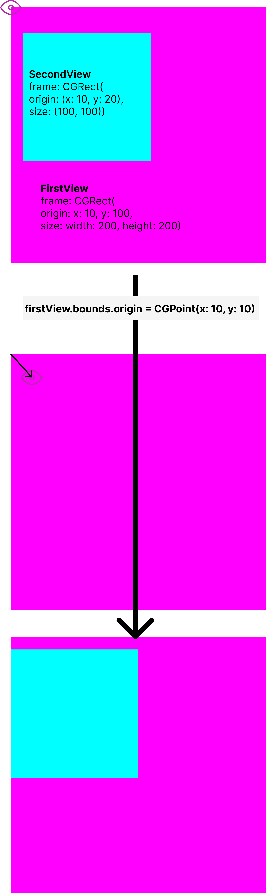
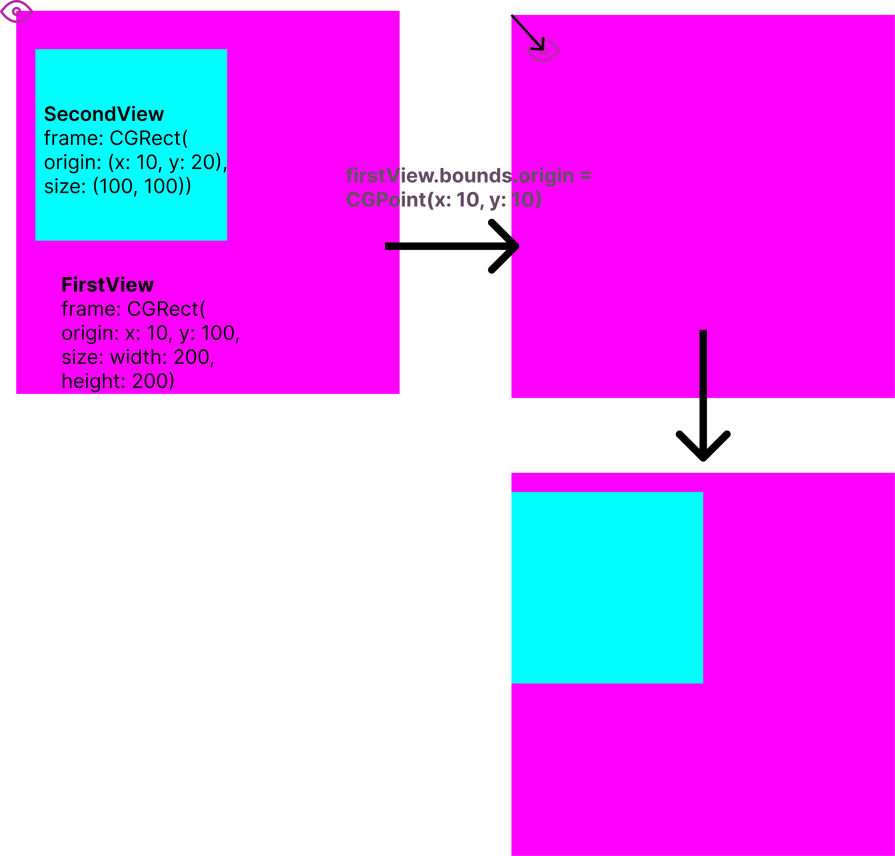

# Frame VS Bounds

## Frame
***Summary***

>The frame rectangle, which describes the view’s location and size ***in its superview’s coordinate system***. (superView 의 좌표계에 대한 view 의 location, size)

Declaration

```swift
var frame: CGRect { get set }
```
***Discussion***

>This rectangle defines the size and position of the view in its superview’s coordinate system. Use this rectangle during layout operations to set the size and position the view. Setting this property changes the point specified by the center property and changes the size in the bounds rectangle accordingly. The coordinates of the frame rectangle are always specified in points.
Warning
>If the transform property is not the identity transform, the value of this property is undefined and therefore should be ignored.
Changing the frame rectangle automatically redisplays the view without calling its draw(_:) method. If you want UIKit to call the draw(_:) method when the frame rectangle changes, set the contentMode property to UIView.ContentMode.redraw.
>Changes to this property can be animated. However, if the transform property contains a non-identity transform, the value of the frame property is undefined and should not be modified. In that case, reposition the view using the center property and adjust the size using the bounds property instead.

<br>

### **SuperView** 의 **origin**을 (0,0) 으로 놓았을 때, **origin**으로부터 떨어져 있는 위치 == *view.frame.origin(x,y)*
> **origin**: View 의 가장 왼쪽, 윗부분
 
<br><br>

### frame 의 size 는 View 자체의 크기가 아니라, _**View 가 차지하는 영역을 감싸서 만든 사각형의 영역**_. <br>
따라서, View 를 회전시키면 origin, frame 모두 변할 수 있다. 
<br>


<!-- ![rotated_frame] -->

>이때, bounds 는 동일 (origin: (0,0), size: (w:279, h:224))

<br>
<br>
<hr>
<br>


## Bounds

<br>

**Summary**
 
> The bounds rectangle, which describes the view’s location and size in its **own coordinate system**  (자신의 좌표계에 대한 location, size)

**Declaration**
```swift
var bounds: CGRect { get set }
```
Discussion

>***The default bounds origin is (0,0)*** and the size is the same as the size of the rectangle in the frame property. **Changing the size portion of this rectangle grows or shrinks the view relative to its center point**. Changing the size also changes the size of the rectangle in the frame property to match. The coordinates of the bounds rectangle are always specified in points.
Changing the bounds rectangle automatically redisplays the view without calling its draw(_:) method. If you want UIKit to call the draw(_:)
 method, set the contentMode property to UIView.ContentMode.redraw.
Changes to this property can be animated.

<br>

## Frame이 SuperView 에서의 **상대**좌표계였다면, bounds 는 **자신의 좌표계**

좌표의 시작점을 자신의 원점으로 놓음. 따라서, View 를 생성하면 bounds 의 origin 은 반드시 (0,0) 으로 초기화 되어있음.

bounds 의 size 는 View 자체의 영역을 나타낸 것. 따라서, 회전해도 값은 동일(origin 도 동일)  
(frame: View 가 차지하는 영역을 감싸서 만든 사각형의 영역)
<br><br>
||frame|bounds||
|:---|:---:|:---:|---|
|origin(x,y)|superView 의 좌표계|자신의 좌표계|
|size(width, height)|View 영역을 모두 감싸는 사각형|View 영역 자체|


<br>


<hr>
<br>
<br>

## 둘은 각각 언제, 어떻게 사용할까?

View - **frame** 의 origin 값을 변경하면, 해당 View 의 SubViews 도 그만큼 같이 이동.  
View - bounds.origin 의 값을 변경하면, 해당 View 의 ***시점*** 이 그만큼 이동.  
<br>
예를 들어 설명하면, 기존 (0,0)의 bounds.origin 은 사람이 끝점에서 모든 SubViews 보는 상태이고,<br> bounds.origin 을 이동시키면 사람이 해당 좌표만큼 이동 후 보게 되어, SubView 들이 상대적으로 움직인 것처럼 보임. <br><br>
<!--  -->

<br><br><br>
<hr>
<br>

Bounds 의 활용
**ScrollView** 에서 scroll 시 *bounds* 의 *origin* 이 변함<br><br>
```
bounds.origin: (594.3333333333334, 213.0)
bounds.origin: (614.6666666666666, 213.0)
bounds.origin: (634.6666666666666, 213.0)
bounds.origin: (654.0, 213.0)
bounds.origin: (672.6666666666666, 213.0)
bounds.origin: (690.6666666666666, 213.0)
bounds.origin: (708.3333333333334, 213.0)
bounds.origin: (725.0, 213.0)
bounds.origin: (741.3333333333334, 213.0)
bounds.origin: (757.3333333333334, 213.0)
bounds.origin: (772.6666666666666, 213.0)
bounds.origin: (787.3333333333334, 213.0)
bounds.origin: (801.6666666666666, 213.0)
bounds.origin: (815.3333333333334, 213.0)
bounds.origin: (828.6666666666666, 213.0)
bounds.origin: (841.6666666666666, 213.0)
```

<br>
<br>

**UIScrollView** 의 ***ContentOffset***: Bounds 의 **origin** 설정

**Summary**

> The point at which the origin of the content view is offset from the origin of the scroll view.

**Declaration**

```swift
var contentOffset: CGPoint { get set }  
```
**Discussion**
>The default value is CGPointZero.

<br>
<br>

**UIView** 의 ***clipsToBounds***

***Summary***
>A Boolean value that determines whether subviews are confined to the bounds of the view.
Declaration

```swift 
var clipsToBounds: Bool { get set }
```

***Discussion***
>Setting this value to true causes subviews to be clipped to the bounds of the view. If set to false, subviews whose frames extend beyond the visible bounds of the view aren’t clipped.
The default value is false. Some subclasses of UIView, like UIScrollView, override the default value to true.

<br>
출처<br>
https://babbab2.tistory.com/44<br>
https://babbab2.tistory.com/45<br>  
https://babbab2.tistory.com/46<br>
https://www.youtube.com/watch?v=Nfzy1qgxSAg  

<!-- 
 -->
<!-- 

https://drive.google.com/file/d/1TZVBBJuJ4bT1JmCiFbn6GWNlzP0pggmV/view?usp=sharing

1TZVBBJuJ4bT1JmCiFbn6GWNlzP0pggmV -->
